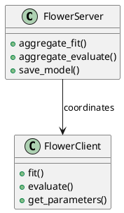
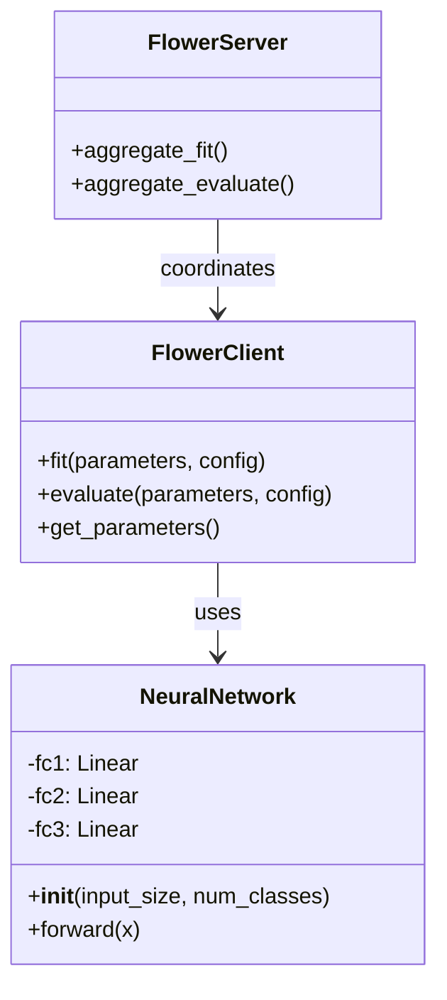

17297781Karthik: Hey I have done till this,But after this what to do I dont know in this project to be a ready to use realworld standards and how to use this actually so could you carefully analyse and tell what need to be done here...
You can also explain me the usecases and scenarios and stakeholders and their roles in the real world to use this project...
What I am tryna play with is...I have huge dataset of network data of iot devices Im trying to train a MLP with decentralised data...
What is actually my problem is...I am not able to present this with 100% clarity to the managers what actually it is doing and how effective it is and how this is best when compared to normal ML system...

So take your time and guide /explain everyting I have asked for in detail

GitHub Copilot: Below is an overview of the project and some ideas on how to evolve it toward a robust, production-ready, real-world solution.

---

### What You’ve Built So Far

- **Decentralized Training:**  
  You have a federated learning (FL) setup using Flower. The server code (server.py) coordinates training rounds using the federated averaging (FedAvg) strategy, while client1.py represents one client that trains a multilayer perceptron (MLP) on a subset of IoT network data locally.

- **Model Architecture:**  
  The model is a simple three-layer neural network defined in model.py. It processes input data (with 17 features) and outputs predictions across 10 classes (e.g., different types of IoT malware).

- **Data Preprocessing:**  
  The client loads a preprocessed CSV dataset, standardizes values, and splits it into training and test sets.

- **Logging and Checkpointing:**  
  The server aggregates updates from clients, logs info, and saves model checkpoints periodically.

---

### Real-World Use Cases & Scenarios

1. **IoT Malware Detection:**  
   - **Scenario:** A company monitors network traffic from hundreds (or thousands) of IoT devices in a distributed environment.  
   - **How It Works:** Instead of sending raw data to a central server (thus preserving privacy and reducing bandwidth), each edge device (or local server) performs training locally, and only model updates are sent to a central aggregator.
   - **Benefits:** 
     - **Privacy/Security:** Raw network data remains on edge devices.
     - **Scalability:** Decentralized training can handle huge volumes of data.
     - **Up-to-date Learning:** Continuous updates from edge devices, capturing local changes quickly.

2. **Decentralized Anomaly Detection in Network Traffic:**  
   - **Scenario:** Telecom companies or security firms keep their data local but want to deploy a standardized model to monitor network anomalies.
   - **How It Works:** Each client runs their local training on network logs, and the FL server aggregates improvements for a global threat detection model.
   - **Benefits:** Improved generalizability and robustness across various network environments without needing centralized data storage.

3. **Compliance with Data Regulations:**  
   - **Scenario:** In sectors where data privacy regulations are strict (e.g., healthcare, finance, IoT in critical infrastructure), federated learning minimizes data transfer.
   - **How It Works:** Local computing ensures that sensitive information never leaves its location.
   - **Benefits:** Compliance with laws (GDPR, HIPAA, etc.) while still leveraging aggregate learning benefits.

---

### Roles and Stakeholders in a Real-World Deployment

1. **Project Manager / Business Manager:**  
   - **Role:** Oversees project objectives, business strategies, and ROI.  
   - **What You Explain:**  
     - The benefits of privacy-preserving, decentralized training.
     - Cost and time savings by reducing data movement.
     - How the system adapts to new threats through continuous learning.

2. **Data Scientists / ML Engineers:**  
   - **Role:** Develop the FL model and fine-tune it using domain-specific network data.
   - **What You Explain:**  
     - The technical details of federated averaging vs. centralized training.
     - Performance metrics (accuracy, loss trends) across training rounds.
     - How aggregation helps in mitigating overfitting to local data peculiarities.

3. **DevOps / IT Infrastructure:**  
   - **Role:** Deployment, monitoring, and orchestration of both the server and edge client implementations.
   - **What You Explain:**  
     - The system’s software/hardware requirements.
     - How to handle checkpointing and fault tolerance.
     - The deployment pipeline for seamlessly integrating new clients or updating models.

4. **Security Experts:**  
   - **Role:** Ensure the FL process is secure and that data privacy is maintained.
   - **What You Explain:**  
     - How FL addresses privacy issues by keeping raw data local.
     - Security mechanisms in place (e.g., secure aggregation, encryption for parameter transmission).
     - Strategies for model update verification to avoid adversarial attacks.

---

### How This Approach Is Superior to Traditional ML

- **Data Privacy:**  
  Unlike a centralized approach where all data is sent to and stored at a central hub, here the raw data remains on-site. This is both a security and regulatory win.

- **Reduced Bandwidth and Storage Costs:**  
  Only model parameters (and not the raw data) are transferred, reducing network load and storage requirements at the central server.

- **Adaptive and Resilient Learning:**  
  Federated learning gathers diverse updates from different environments. The aggregated model is often more robust to changes and anomalies seen only in localized scenarios.

- **Faster Iterations on Local Data:**  
  Clients can quickly update their models reflecting local data trends. When summed centrally, the aggregated model benefits from a wider perspective without the delay of transferring large datasets.

---

### Steps Toward a Production-Ready System

1. **Robust Data Pipeline:**  
   - Automate data ingestion, preprocessing, and distribution to clients.
   - Incorporate data quality checks and scaling for huge volume of network logs.

2. **Enhanced Security Measures:**  
   - Add secure aggregation protocols to the FL system.
   - Ensure the communication between clients and the server is encrypted (e.g., using SSL/TLS).

3. **Scalability and Fault Tolerance:**  
   - Develop mechanisms to handle client dropouts or unreliable connectivity.
   - Implement robust error handling and monitoring tools.

4. **Performance Metrics and Monitoring:**  
   - Design dashboards for real-time monitoring of training progress.
   - Highlight improvements over time compared to traditional centralized training benchmarks.

5. **Model Validation and Testing:**  
   - Perform extensive simulation studies and pilot deployments.
   - Use cross-validation techniques on decentralized data and compare performance metrics.

6. **Integration with Edge Devices:**  
   - Work with embedded system teams to integrate the trained models.
   - Ensure models can be updated over-the-air to IoT devices in the field.

7. **Comprehensive Documentation and Reporting:**  
   - Prepare detailed technical documentation of the workflow, design choices, and data handling.
   - Prepare reports and presentations that map technical details with business benefits for management.

---

### Final Thoughts for Presentation to Managers

When explaining to management, focus on the value proposition:

- **Innovation in Security:** Federated learning ensures that sensitive network data never leaves the premises, substantially reducing privacy risks.
- **Cost-Efficiency:** By transferring only model parameters, the system reduces data storage and bandwidth costs.
- **Adaptability and Resilience:** A model that continuously learns from various deployment scenarios is often better equipped to handle new threats compared to a one-time centrally-trained model.
- **Regulatory Compliance:** Meeting privacy regulations becomes less challenging because the data remains local.

This structured explanation should provide clarity on how the decentralized solution works, its benefits, and how it outperforms traditional ML systems, thereby making it easier for managers and other stakeholders to see its value.

Feel free to ask if you need further details on any part!

17297781Karthik: Robust Data Pipeline:

Automate data ingestion, preprocessing, and distribution to clients.
Incorporate data quality checks and scaling for huge volume of network logs.
Enhanced Security Measures:

Add secure aggregation protocols to the FL system.
Ensure the communication between clients and the server is encrypted (e.g., using SSL/TLS).
Scalability and Fault Tolerance:

Develop mechanisms to handle client dropouts or unreliable connectivity.
Implement robust error handling and monitoring tools.
Performance Metrics and Monitoring:

Design dashboards for real-time monitoring of training progress.
Highlight improvements over time compared to traditional centralized training benchmarks.
Model Validation and Testing:

Perform extensive simulation studies and pilot deployments.
Use cross-validation techniques on decentralized data and compare performance metrics.


this is vague I want a detailed elaboration how actually to implement this..what should actually be the approach I mean i am dumb boss explain explain

GitHub Copilot: Below is a detailed explanation of how you could implement each element of your project. This explanation is broken down into practical steps, technologies, and design ideas, so that even if you’re new to these concepts, you can follow along.

---

## 1. Robust Data Pipeline

### a. Data Ingestion & Preprocessing
- **Tools/Frameworks:**  
  Use tools like Apache Kafka for real-time data ingestion or Apache Airflow for scheduled batch jobs. For Python, Pandas is great for preprocessing.
- **Steps:**  
  1. **Data Collection:**  
     - Use a script or service (e.g., using Python’s requests library or a Kafka consumer) to pull network logs in real time.
     - Example: A Kafka consumer that writes incoming logs to a temporary storage.
        
  2. **Data Validation & Quality Checks:**  
     - Implement routines that check for missing or corrupted data.
     - Log any anomalies and either correct or reject bad records.
        
  3. **Preprocessing:**  
     - Use Pandas for cleaning, filtering, and standardizing the data.
     - Save preprocessed datasets in a shared location (like a database or cloud storage) accessible by the client nodes.
        
  4. **Distribution:**  
     - Once data is preprocessed, use REST APIs, message queues, or shared file systems to distribute the data to FL clients.
     - For scalability, consider containerizing your preprocessing service with Docker and using Kubernetes for orchestration.

*Example snippet for data loading using Pandas:*

````python
import pandas as pd

def load_data(file_path):
    df = pd.read_csv(file_path)
    # Quality check: drop rows with missing values
    df_clean = df.dropna()
    # Preprocess: standardize numerical columns as needed
    # Logging can be added here for data quality issues.
    return df_clean

if __name__ == "__main__":
    data = load_data("network_logs.csv")
    data.to_csv("preprocessed/network_logs_clean.csv", index=False)
````

### b. Scaling for Huge Volumes
- Use distributed data processing frameworks like Apache Spark if the volume of logs grows very large. Spark can distribute processing over many nodes.

---

## 2. Enhanced Security Measures

### a. Secure Aggregation Protocols
- **Concept:**  
  In FL, secure aggregation means that the server aggregates model updates without being able to see individual updates. Look into protocols such as Secure Multi-Party Computation (MPC) or libraries that support homomorphic encryption.
- **Implementation Idea:**  
  - For example, frameworks like PySyft provide tools for secure and private FL.
  - Alternatively, research secure aggregation algorithms in the recent literature and see if Flower or your clients support plugins for secure aggregation.
 
*Example approach:*
- Wrap the model parameters before sending them in a secure protocol (e.g., by adding a secure mask).
- At aggregation, the mask is removed in a way that the original data remains hidden.

### b. Encrypted Communication (SSL/TLS)
- **Steps:**
  1. **Server Side:**  
     - Enable HTTPS or secure gRPC if Flower supports it.  
     - Generate SSL certificates (self-signed for test or from a CA for production).
  2. **Client Side:**  
     - Ensure that the client checks the server certificate before sending parameters.
- **Commands (Windows):**  
  Use OpenSSL in a terminal to generate a self-signed certificate:
  ```
  openssl req -x509 -newkey rsa:4096 -keyout key.pem -out cert.pem -days 365 -nodes
  ```
- **Configuration:**  
  Make sure that your network communication in your FL framework is configured to use these certificates.

---

## 3. Scalability and Fault Tolerance

### a. Handling Client Dropouts or Unreliable Connectivity
- **Strategies:**
  - **Timeouts and Retries:**  
    Configure clients to retry connecting if a dropout occurs.  
    Use exponential backoff mechanism.
  - **Client Evaluation:**  
    Keep track of client history on the server to weigh contributions.
  - **Asynchronous Updates:**  
    Consider asynchronous federated learning schemes where the server does not wait for all clients.
    
### b. Robust Error Handling & Monitoring Tools
- **Monitoring:**  
  Use centralized logging tools (e.g., ELK Stack—Elasticsearch, Logstash, and Kibana) to monitor errors and performance.
- **Error Handling:**  
  - Implement try-except blocks around network communications.
  - Log exceptions to a file (as you have with Python’s logging).
- **Use of Frameworks:**  
  Tools like Prometheus can collect metrics, and Grafana can create dashboards.

*Example:*
````python
try:
    # Communication with a client
    client_response = send_model_update(client)
except Exception as e:
    logging.error(f"Error communicating with client: {str(e)}")
    # Optionally, implement a retry mechanism here.
````

---

## 4. Performance Metrics and Monitoring

### a. Designing Dashboards for Real-Time Monitoring
- **Tools:**  
  - Prometheus for metrics collection.
  - Grafana for dashboards.
  - Optionally, integrate with TensorBoard for visualizing training progress.
- **Metrics to Monitor:**
  - Training loss and accuracy per round.
  - Communication latency.
  - Number of clients connected.
  - System resource utilization (CPU, memory).
  
### b. Implementation Approach:
1. **Expose Metrics:**  
   - Use Python’s Prometheus client library to expose metrics endpoints from both server and client code.
2. **Configuration:**  
   - Set up a Prometheus server to scrape metrics endpoints.
   - Create Grafana panels that visualize these metrics.
3. **Example Code:**
````python
from prometheus_client import start_http_server, Summary
import time

# Create a metric to track time spent and requests made.
REQUEST_TIME = Summary('request_processing_seconds', 'Time spent processing request')

@REQUEST_TIME.time()
def process_request():
    time.sleep(0.5)  # simulate some processing

if __name__ == '__main__':
    start_http_server(8000)  # Expose metrics on port 8000
    while True:
        process_request()
````

---

## 5. Model Validation and Testing

### a. Simulation Studies and Pilot Deployments
- **Before full-scale deployment:**
  - Run pilot tests with a limited number of clients.
  - Use simulation frameworks (potentially even a simulated FL environment) to mimic poor connectivity or client dropouts.
  
### b. Cross-Validation Techniques on Decentralized Data
- **Methodology:**
  - Each client can perform its own k-fold cross-validation during training.
  - Aggregate the validation metrics using weighted averages as done in your server code.
- **Automated Testing:**
  - Write unit tests to ensure each part of the pipeline is working correctly.
  - For instance, tests for data quality checks, secure communications (mocking the SSL layer), and aggregation functions.

*Example (unit test for data quality):*
````python
import unittest
import pandas as pd
from data_pipeline.ingest import load_data

class TestDataPipeline(unittest.TestCase):
    def test_load_data(self):
        df = load_data("tests/sample_network_logs.csv")
        # Check if DataFrame is not empty and is cleaned properly
        self.assertTrue(not df.empty)
        self.assertEqual(df.isnull().sum().sum(), 0)

if __name__ == '__main__':
    unittest.main()
````

---

## Summary

- **Data Pipeline:**  
  Implement automated ingestion using tools like Kafka or Airflow, preprocess with Pandas/Spark, and distribute data via APIs or shared file systems.
  
- **Security:**  
  Adopt secure aggregation (MPC/homomorphic encryption) and use SSL/TLS for secure communications.
  
- **Scalability & Fault Tolerance:**  
  Introduce client timeout/retry policies, monitor client connectivity, and use asynchronous communication strategies.
  
- **Monitoring:**  
  Use Prometheus and Grafana for real-time monitoring of system metrics. Expose metrics from both server and client applications.
  
- **Model Validation:**  
  Pilot the system with simulation studies, implement cross-validation in the decentralized setup, and ensure rigorous unit/integration testing.

By following these detailed steps and integrating industry-standard tools, you can build a production-ready, scalable, and secure federated learning system for IoT network data while providing clear and compelling explanations for stakeholders.

17297781Karthik: fine consider I have a service that if i give a csv file path it will do everything for me...Since i want to mock attacks like mirai and stuff as a student i dont have much resources how can I have system that produces the fake data/mock data for testing exactly like real world devices with these features and how can I get these features 

Combined Important Features Across All Devices\n(Based on Decision Tree + Variance Analysis with 12K samples per file)\n======================================================================\n  1. HH_L0.01_magnitude\n  2. HH_L0.01_radius\n  3. HH_L0.01_std\n  4. HH_L0.01_weight\n  5. HH_L0.1_covariance\n  6. HH_L0.1_magnitude\n  7. HH_L0.1_mean\n  8. HH_L0.1_pcc\n  9. HH_L0.1_radius\n 10. HH_L0.1_weight\n 11. HH_L1_radius\n 12. HH_L3_radius\n 13. HH_L5_magnitude\n 14. HH_L5_radius\n 15. HH_L5_weight\n 16. HH_jit_L0.01_mean\n 17. HH_jit_L0.01_variance\n 18. HH_jit_L0.01_weight\n 19. HH_jit_L0.1_mean\n 20. HH_jit_L0.1_variance\n 21. HH_jit_L0.1_weight\n 22. HH_jit_L1_mean\n 23. HH_jit_L1_variance\n 24. HH_jit_L3_mean\n 25. HH_jit_L3_variance\n 26. HH_jit_L5_mean\n 27. HH_jit_L5_variance\n 28. H_L0.01_mean\n 29. H_L0.01_variance\n 30. H_L0.01_weight\n 31. H_L0.1_mean\n 32. H_L0.1_variance\n 33. H_L0.1_weight\n 34. H_L1_variance\n 35. H_L1_weight\n 36. H_L3_variance\n 37. H_L5_variance\n 38. H_L5_weight\n 39. HpHp_L0.01_magnitude\n 40. HpHp_L0.01_radius\n 41. HpHp_L0.01_weight\n 42. HpHp_L0.1_covariance\n 43. HpHp_L0.1_weight\n 44. HpHp_L1_magnitude\n 45. HpHp_L1_mean\n 46. HpHp_L1_weight\n 47. MI_dir_L0.01_mean\n 48. MI_dir_L0.01_variance\n 49. MI_dir_L0.01_weight\n 50. MI_dir_L0.1_mean\n 51. MI_dir_L0.1_variance\n 52. MI_dir_L0.1_weight\n 53. MI_dir_L1_mean\n 54. MI_dir_L1_variance\n 55. MI_dir_L1_weight\n 56. MI_dir_L3_variance\n 57. MI_dir_L3_weight\n 58. MI_dir_L5_mean\n

GitHub Copilot: Below is an explanation and a sample implementation idea for generating synthetic (mock) IoT network CSV data that mimics real-world features and can also simulate attacks like Mirai.

---

## Overview

Imagine you have a service that takes a CSV file path and processes it. To test it in an environment that mimics production, you need to generate realistic mock data. The idea is to create a generator that outputs files with the same 58 features you listed. This synthetic data should reflect statistical properties (e.g., mean, variance, correlation) that you’d expect from true network traffic data. You can then even inject “attack patterns” (like anomalies seen in Mirai) by modifying a subset of the features.

---

## Steps to Implement a Synthetic Data Generator

### 1. Analyze or Assume Statistical Distributions

- **If You Have Access to a Small Real-World Sample:**  
  Estimate the mean, standard deviation (or variance), and even correlations between features for normal operation.  
- **If Not:**  
  Assume common distributions, typically a normal distribution (or log-normal for certain magnitude features).  
- **Feature Correlations:**  
  If your features are interrelated (as suggested by decision tree and variance analysis), you can use a multivariate normal distribution to simulate correlations among groups of features. Otherwise, generate them independently.

---

### 2. Design the Generator

- **Parameterizable for Scale:**  
  Allow the user to specify the number of samples (e.g., 12K samples per file) and the proportion of “attack” samples.
- **Normal vs. Attack Data:**  
  In normal mode, generate samples according to your estimated distribution. For attack samples, perturb key features (for example, features related to magnitude or variance might be significantly larger or have unusual patterns) to mimic the behavior of a Mirai attack.
- **Injection of Noise:**  
  Random noise can help realistically mimic slight variations in device behavior.

---

### 3. Implementation Using Python

Here’s a sample code snippet illustrating a basic approach:

````python
import numpy as np
import pandas as pd

# Define your feature names as provided.
FEATURES = [
    "HH_L0.01_magnitude", "HH_L0.01_radius", "HH_L0.01_std", "HH_L0.01_weight",
    "HH_L0.1_covariance", "HH_L0.1_magnitude", "HH_L0.1_mean", "HH_L0.1_pcc",
    "HH_L0.1_radius", "HH_L0.1_weight", "HH_L1_radius", "HH_L3_radius",
    "HH_L5_magnitude", "HH_L5_radius", "HH_L5_weight", "HH_jit_L0.01_mean",
    "HH_jit_L0.01_variance", "HH_jit_L0.01_weight", "HH_jit_L0.1_mean", "HH_jit_L0.1_variance",
    "HH_jit_L0.1_weight", "HH_jit_L1_mean", "HH_jit_L1_variance", "HH_jit_L3_mean",
    "HH_jit_L3_variance", "HH_jit_L5_mean", "HH_jit_L5_variance", "H_L0.01_mean",
    "H_L0.01_variance", "H_L0.01_weight", "H_L0.1_mean", "H_L0.1_variance",
    "H_L0.1_weight", "H_L1_variance", "H_L1_weight", "H_L3_variance",
    "H_L5_variance", "H_L5_weight", "HpHp_L0.01_magnitude", "HpHp_L0.01_radius",
    "HpHp_L0.01_weight", "HpHp_L0.1_covariance", "HpHp_L0.1_weight", "HpHp_L1_magnitude",
    "HpHp_L1_mean", "HpHp_L1_weight", "MI_dir_L0.01_mean", "MI_dir_L0.01_variance",
    "MI_dir_L0.01_weight", "MI_dir_L0.1_mean", "MI_dir_L0.1_variance", "MI_dir_L0.1_weight",
    "MI_dir_L1_mean", "MI_dir_L1_variance", "MI_dir_L1_weight", "MI_dir_L3_variance",
    "MI_dir_L3_weight", "MI_dir_L5_mean"
]

def generate_samples(num_samples=12000, attack=False, random_state=None):
    np.random.seed(random_state)
    data = {}
    
    # For demonstration, we assume each feature follows a normal distribution.
    # In practice, adjust mean and std per feature based on your analysis.
    for feat in FEATURES:
        mean = 0
        std = 1
        
        # For features that might be affected by an attack, modify parameters
        if attack and ("magnitude" in feat or "radius" in feat or "variance" in feat):
            mean += np.random.uniform(5, 10)  # increased mean
            std *= np.random.uniform(1.5, 2.5)  # larger spread
        
        # Generate random samples
        data[feat] = np.random.normal(loc=mean, scale=std, size=num_samples)
    
    return pd.DataFrame(data)

def main():
    # Generate normal data
    normal_data = generate_samples(num_samples=12000, attack=False, random_state=42)
    
    # Optionally, generate attack data (split ratio, say 10% attack samples)
    attack_data = generate_samples(num_samples=1200, attack=True, random_state=99)
    
    # Combine and shuffle
    combined = pd.concat([normal_data, attack_data], ignore_index=True)
    combined = combined.sample(frac=1, random_state=123).reset_index(drop=True)
    
    # Save to CSV file
    combined.to_csv("mock_iot_data.csv", index=False)
    print("Synthetic data saved to mock_iot_data.csv")

if __name__ == "__main__":
    main()
````

---

## 4. Explanation of the Code

- **Feature List:**  
  A list of 58 features is defined exactly as provided.

- **Generation Function:**  
  The function `generate_samples()` creates either normal or attack data. It:
  - Sets a default mean and standard deviation.
  - For features that might show abnormal behavior during an attack (e.g., those with "magnitude," "radius," or "variance"), it perturbs the mean and scale when `attack=True`.
  - Generates normal samples via `np.random.normal` for each feature.
  
- **Combining Data:**  
  In the `main()` function, normal and attack samples are generated separately and then combined and shuffled. This mimics a realistic scenario where most traffic is normal and some percentage presents anomalies.

- **Output:**  
  The combined data is saved in CSV format, which your service can then ingest.

---

## 5. Next Steps

- **Refine Distributions:**  
  The above code uses simple assumptions. Once you have access to even a small real-world dataset, calibrate the distributions (mean, variance, and correlations) for each feature.
  
- **Injecting More Complex Patterns:**  
  For more realistic attacks, you can use rule-based modifications (e.g., abrupt spikes, time series trends, or multivariate correlations) to simulate coordinated behaviors of Mirai-like attacks.

- **Automation & Integration:**  
  Wrap this script into a service (e.g., via a Flask or FastAPI endpoint) so that when you provide a CSV file path or configuration parameters, it produces a synthetic dataset automatically.

This approach helps you mimic real-world IoT device data without needing enormous resources. It creates a testing ground where features and attack scenarios (like those exhibited by Mirai) are clearly represented, making it easier for you or your stakeholders to measure how well decentralized ML models can detect or react to unusual network behaviors.

Feel free to ask if you have further questions or need additional details on any part of the implementation!

17297781Karthik: No not like this...NbaIot dataset was constructed by extracting features from network packets I want to do the same but I dont have packets right?

GitHub Copilot: You can mimic this by generating synthetic network packets and saving them in a capture file format (pcap). Then you run your feature extraction on these packets. Since you don’t have real packets, you can use tools like Scapy in Python to craft and simulate network traffic. Here’s how you can approach it:

1. **Packet Simulation with Scapy:**  
   Use Scapy to create various layers (Ethernet, IP, TCP/UDP, etc.) with randomized but realistic values. You can simulate normal traffic and even inject “attack” patterns by tweaking packet properties.

2. **Saving to a pcap File:**  
   Once you craft a batch of packets, save them into a pcap file. Later, you can run your extraction algorithms on this file to compute the desired features (similar to how the NbaIot dataset was created).

3. **Feature Extraction Pipeline:**  
   Build a pipeline that reads the pcap file, parses the packets, and computes statistical features (e.g., magnitudes, variances) across various packet attributes. You can reuse libraries like pyshark or your own Scapy-based parser to extract features.

Below is a sample code snippet that shows how you might generate synthetic packets using Scapy and save them to a pcap file:

````python
from scapy.all import *
import random

def generate_packet():
    # Create a basic Ethernet/IP/TCP packet with random source/destination values
    pkt = Ether() / IP(src=f"192.168.1.{random.randint(1,254)}", 
                       dst=f"10.0.0.{random.randint(1,254)}")
    # Randomly choose between TCP and UDP
    if random.random() > 0.5:
        pkt = pkt / TCP(sport=random.randint(1024,65535), dport=80)
    else:
        pkt = pkt / UDP(sport=random.randint(1024,65535), dport=53)
    return pkt

def generate_packets(num_packets=1000):
    packets = []
    for _ in range(num_packets):
        pkt = generate_packet()
        # Optionally, add custom layers or alter fields to simulate anomalies/attacks
        # For example, inflate the payload for an attack pattern.
        if random.random() < 0.1:  # 10% chance
            pkt = pkt / Raw(load="A" * random.randint(50,150))
        packets.append(pkt)
    return packets

def main():
    packets = generate_packets(12000)
    # Save packets to a pcap file
    wrpcap("synthetic_iot_traffic.pcap", packets)
    print("Saved synthetic packets to synthetic_iot_traffic.pcap")

if __name__ == "__main__":
    main()
````

**Next Steps:**

- **Feature Extraction:**  
  Use your existing feature extraction logic on “synthetic_iot_traffic.pcap”. For example, create another script that parses the pcap file and computes the features (like those in the NbaIot dataset).

- **Customization:**  
  Adjust packet parameters and traffic patterns to more closely reflect both benign and attack traffic. This may involve simulating longer sessions, varying protocols, or even timing differences.

This approach lets you simulate a realistic pcap file from which you can extract features just like with actual network data. It’s a good starting point for testing your system when real packet captures aren’t available.

17297781Karthik: Is that approach ok to present it as a part of academic project and are u sure easily ican simulate all attack types

GitHub Copilot: Yes, that approach is acceptable academically as long as you clearly state the limitations. Using tools like Scapy to simulate network traffic and extract features is common in research. However, simulating every attack type in the real world is challenging. Focus on key attack patterns (e.g., Mirai behavior, abnormal payload sizes, etc.) to demonstrate your methodology and note that while your simulations capture essential characteristics, real-world traffic can be more complex.

17297781Karthik: Hey can u tell me what are system components and list system components of this project

GitHub Copilot: ## System Components of Federated Learning for IoT Malware Detection

Based on your project, here are the key system components:

### 1. **Core FL Components**

#### **FL Server (Coordinator)**
- **Location:** server.py
- **Purpose:** Orchestrates the federated learning process
- **Functions:**
  - Manages training rounds
  - Aggregates model updates from clients using FedAvg strategy
  - Saves global model checkpoints
  - Handles client coordination and communication

#### **FL Clients (Edge Nodes)**
- **Location:** client1.py (can be multiple clients)
- **Purpose:** Local training on distributed data
- **Functions:**
  - Local model training on device-specific data
  - Sends model parameters to server
  - Receives updated global model from server

#### **ML Model**
- **Location:** model.py
- **Purpose:** Neural network architecture for malware classification
- **Details:** 3-layer MLP with 17 input features, 10 output classes

### 2. **Data Components**

#### **Data Pipeline**
- **Raw Data:** Network packet captures (pcap files)
- **Feature Extraction Engine:** Converts packets to statistical features
- **Preprocessed Data:** CSV files with 58 network traffic features
- **Data Distribution System:** Distributes data subsets to different clients

#### **Synthetic Data Generator**
- **Packet Simulator:** Scapy-based traffic generation
- **Attack Pattern Injector:** Simulates malware behaviors (Mirai, etc.)
- **Feature Calculator:** Extracts NbaIoT-style features from synthetic packets

### 3. **Security & Communication Components**

#### **Secure Communication Layer**
- **SSL/TLS Encryption:** For client-server communication
- **Certificate Management:** Handles authentication
- **Secure Aggregation:** Protects individual client updates

#### **Privacy Preservation Module**
- **Local Data Isolation:** Raw data never leaves client premises
- **Parameter Transmission:** Only model weights are shared
- **Differential Privacy (Optional):** Additional privacy protection

### 4. **Monitoring & Management Components**

#### **Logging System**
- **Server Logs:** Training progress, aggregation metrics
- **Client Logs:** Local training status, communication events
- **Error Handling:** Exception tracking and recovery

#### **Performance Monitoring**
- **Metrics Collection:** Accuracy, loss, convergence rates
- **Dashboard (Proposed):** Real-time training visualization
- **Resource Monitoring:** CPU, memory, network usage

#### **Model Management**
- **Checkpointing System:** Saves global model states
- **Version Control:** Tracks model iterations
- **Deployment Engine:** Distributes updated models to edge devices

### 5. **Infrastructure Components**

#### **Edge Computing Nodes**
- **IoT Devices/Gateways:** Where clients run
- **Local Storage:** For device-specific data
- **Computing Resources:** For local training

#### **Central Infrastructure**
- **FL Server Host:** Cloud or on-premise server
- **Model Repository:** Stores global model versions
- **Configuration Management:** System parameters and settings

### 6. **Testing & Validation Components**

#### **Simulation Environment**
- **Traffic Generator:** Creates realistic network scenarios
- **Attack Simulator:** Mimics various malware behaviors
- **Performance Benchmarking:** Compares FL vs centralized approaches

#### **Quality Assurance**
- **Unit Testing Framework:** Tests individual components
- **Integration Testing:** End-to-end system validation
- **Cross-validation System:** Validates model performance

### 7. **Configuration & Control Components**

#### **System Configuration**
```python
# Example configuration parameters
NUM_ROUNDS = 4
MIN_CLIENTS = 2
INPUT_SIZE = 17
NUM_CLASSES = 10
BATCH_SIZE = 264
LEARNING_RATE = 0.001
```

#### **Client Management**
- **Client Registration:** Handles new client enrollment
- **Load Balancing:** Distributes training load
- **Fault Tolerance:** Handles client dropouts

### **System Architecture Diagram (Conceptual)**

```
┌─────────────────┐    ┌─────────────────┐    ┌─────────────────┐
│   IoT Device 1  │    │   IoT Device 2  │    │   IoT Device N  │
│  (FL Client)    │    │  (FL Client)    │    │  (FL Client)    │
│                 │    │                 │    │                 │
│ • Local Data    │    │ • Local Data    │    │ • Local Data    │
│ • Local Model   │    │ • Local Model   │    │ • Local Model   │
│ • Training      │    │ • Training      │    │ • Training      │
└─────────┬───────┘    └─────────┬───────┘    └─────────┬───────┘
          │                      │                      │
          │         Secure Communication (SSL/TLS)      │
          │                      │                      │
          └──────────────────────┼──────────────────────┘
                                 │
                    ┌─────────────▼─────────────┐
                    │     FL Server             │
                    │                           │
                    │ • Model Aggregation       │
                    │ • Round Coordination      │
                    │ • Global Model Storage    │
                    │ • Performance Monitoring  │
                    └───────────────────────────┘
```

### **Component Interaction Flow**

1. **Initialization:** Server initializes global model
2. **Distribution:** Server sends model to registered clients
3. **Local Training:** Clients train on local data
4. **Update Sharing:** Clients send model updates to server
5. **Aggregation:** Server aggregates updates using FedAvg
6. **Global Update:** Server updates global model
7. **Repeat:** Process continues for specified rounds

This component breakdown gives you a comprehensive view of your federated learning system architecture, which you can present in academic settings or to stakeholders.

Similar code found with 1 license type

17297781Karthik: How can I create uml easily

GitHub Copilot: Here are several easy ways to create UML diagrams for your federated learning project:

## 1. **Online Tools (Easiest - No Installation)**

### **draw.io (diagrams.net)** - FREE & RECOMMENDED
- **URL:** https://app.diagrams.net/
- **Why it's great:**
  - Free, no registration required
  - Huge library of UML shapes
  - Auto-save to Google Drive/OneDrive
  - Export to PNG, PDF, SVG
  - Pre-built UML templates

### **Lucidchart** - FREE TIER
- **URL:** https://www.lucidchart.com/
- **Features:** Professional templates, real-time collaboration
- **Limitation:** Free tier has document limits

### **PlantUML Online** - FREE
- **URL:** http://www.plantuml.com/plantuml/
- **Why it's unique:** Text-based UML generation
- **Example:**


## 2. **Desktop Software**

### **Visual Paradigm Community Edition** - FREE
- **Download:** https://www.visual-paradigm.com/
- **Features:** Full UML support, code generation
- **Best for:** Academic projects

### **StarUML** - FREEMIUM
- **Download:** http://staruml.io/
- **Features:** Professional UML modeling

## 3. **Code-Based (For Programmers)**

### **Mermaid** - TEXT-BASED


### **PlantUML with VS Code**
- Install PlantUML extension in VS Code
- Write UML in text format
- Preview automatically

## 4. **Quick Start Recommendation**

**For your federated learning project, I recommend draw.io:**

1. Go to https://app.diagrams.net/
2. Choose "Create New Diagram"
3. Select "UML" template
4. Drag and drop shapes for your components

## 5. **Sample UML for Your Project**

Here's what you could create with draw.io:

### **System Architecture Diagram**
```
┌─────────────────┐
│   <<boundary>>  │
│   FL Client     │
│                 │
│ +train_local()  │
│ +send_updates() │
└─────────────────┘
         │
         ▼
┌─────────────────┐
│  <<control>>    │
│   FL Server     │
│                 │
│ +aggregate()    │
│ +coordinate()   │
└─────────────────┘
```

### **Class Diagram Elements for Your Project**
- **NeuralNetwork** class
- **FlowerClient** class  
- **FlowerServer** class
- **SaveModelStrategy** class
- **DataLoader** utility

## 6. **Templates You Can Use**

**Component Diagram Template:**
```
[FL Client 1] ---> [FL Server] <--- [FL Client 2]
     |                |                |
     v                v                v
[Local Data]    [Global Model]   [Local Data]
```

**Sequence Diagram Template:**
```
Client -> Server: send_parameters()
Server -> Server: aggregate()
Server -> Client: updated_model()
Client -> Client: local_training()
```

**Start with draw.io - it's the easiest and most feature-rich free option!** You can create professional UML diagrams in minutes without any software installation.

17297781Karthik: In any respect can U create this usecase diagrams,UML diagrams etc here itself

GitHub Copilot: Yes! I can create UML diagrams using text-based representations. Here are the key diagrams for your Federated Learning IoT Malware Detection project:

## 1. Use Case Diagram

```
                    Federated Learning IoT Malware Detection System
    
    ┌─────────────────────────────────────────────────────────────────────────────┐
    │                                                                             │
    │  IoT Device Owner                     System Administrator                  │
    │       │                                      │                             │
    │       │                                      │                             │
    │       ▼                                      ▼                             │
    │  ┌─────────────┐                    ┌─────────────────┐                   │
    │  │   Monitor   │                    │  Configure FL   │                   │
    │  │   Device    │                    │    Server       │                   │
    │  └─────────────┘                    └─────────────────┘                   │
    │       │                                      │                             │
    │       │                                      │                             │
    │       ▼                                      ▼                             │
    │  ┌─────────────┐    ┌─────────────────┐ ┌─────────────────┐               │
    │  │  Participate│    │  Train Local    │ │   Aggregate     │               │
    │  │  in FL      │◄───┤     Model       │ │    Models       │               │
    │  │  Training   │    └─────────────────┘ └─────────────────┘               │
    │  └─────────────┘                               │                          │
    │       │                                        │                          │
    │       │                                        ▼                          │
    │       ▼                                ┌─────────────────┐                 │
    │  ┌─────────────┐                      │   Save Global   │                 │
    │  │   Detect    │                      │     Model       │                 │
    │  │  Malware    │                      └─────────────────┘                 │
    │  └─────────────┘                               │                          │
    │       │                                        │                          │
    │       │                                        ▼                          │
    │       ▼                                ┌─────────────────┐                 │
    │  ┌─────────────┐                      │   Monitor FL    │                 │
    │  │   Generate  │                      │   Performance   │                 │
    │  │   Reports   │                      └─────────────────┘                 │
    │  └─────────────┘                                                          │
    │                                                                             │
    └─────────────────────────────────────────────────────────────────────────────┘
```

## 2. Class Diagram

```
    ┌─────────────────────────────┐
    │      NeuralNetwork          │
    ├─────────────────────────────┤
    │ - fc1: Linear               │
    │ - fc2: Linear               │
    │ - fc3: Linear               │
    │ - relu: ReLU                │
    ├─────────────────────────────┤
    │ + __init__(input_size, num_classes) │
    │ + forward(x): Tensor        │
    └─────────────────────────────┘
                    △
                    │ uses
                    │
    ┌─────────────────────────────┐
    │      FlowerClient           │
    ├─────────────────────────────┤
    │ - net: NeuralNetwork        │
    │ - train_loader: DataLoader  │
    │ - test_loader: DataLoader   │
    │ - criterion: Loss           │
    │ - optimizer: Optimizer      │
    ├─────────────────────────────┤
    │ + fit(parameters, config)   │
    │ + evaluate(parameters, config) │
    │ + get_parameters()          │
    │ + set_parameters(parameters) │
    └─────────────────────────────┘
                    △
                    │ coordinates
                    │
    ┌─────────────────────────────┐
    │    SaveModelStrategy        │
    ├─────────────────────────────┤
    │ - model: NeuralNetwork      │
    ├─────────────────────────────┤
    │ + aggregate_fit()           │
    │ + aggregate_evaluate()      │
    │ + save_model()              │
    └─────────────────────────────┘
                    △
                    │ extends
                    │
    ┌─────────────────────────────┐
    │         FedAvg              │
    ├─────────────────────────────┤
    │ + aggregate_fit()           │
    │ + aggregate_evaluate()      │
    └─────────────────────────────┘
```

## 3. Sequence Diagram

```
FL Server    FL Client1    FL Client2    Global Model
    │            │             │             │
    │ ┌──────────────────────────────────────┐ │
    │ │    Initialization Phase              │ │
    │ └──────────────────────────────────────┘ │
    │            │             │             │
    │──────────────────────────────────────► │ Create Initial Model
    │            │             │             │
    │ ┌──────────────────────────────────────┐ │
    │ │    Training Round 1                  │ │
    │ └──────────────────────────────────────┘ │
    │            │             │             │
    │────────────►             │             │ Send Global Parameters
    │            │─────────────►             │ Send Global Parameters
    │            │             │             │
    │            │ ┌─────────┐ │             │
    │            │ │ Local   │ │             │
    │            │ │Training │ │             │
    │            │ └─────────┘ │             │
    │            │             │ ┌─────────┐ │
    │            │             │ │ Local   │ │
    │            │             │ │Training │ │
    │            │             │ └─────────┘ │
    │            │             │             │
    │◄────────────             │             │ Send Local Updates
    │◄─────────────────────────              │ Send Local Updates
    │            │             │             │
    │ ┌─────────┐│             │             │
    │ │Aggregate││             │             │
    │ │ Updates ││             │             │
    │ └─────────┘│             │             │
    │            │             │             │
    │──────────────────────────────────────► │ Update Global Model
    │            │             │             │
    │ ┌──────────────────────────────────────┐ │
    │ │    Training Round 2                  │ │
    │ └──────────────────────────────────────┘ │
    │            │             │             │
    │────────────►             │             │ Send Updated Parameters
    │            │─────────────►             │ Send Updated Parameters
    │            ...           ...           ...
```

## 4. Component Diagram

```
    ┌─────────────────────────────────────────────────────────────────┐
    │                 Federated Learning System                       │
    │                                                                 │
    │  ┌─────────────────┐              ┌─────────────────────────┐   │
    │  │   FL Server     │              │      FL Clients         │   │
    │  │                 │              │                         │   │
    │  │ ┌─────────────┐ │              │ ┌─────────────────────┐ │   │
    │  │ │   Strategy  │ │              │ │    Local Training   │ │   │
    │  │ │ (FedAvg)    │ │              │ │     Component       │ │   │
    │  │ └─────────────┘ │              │ └─────────────────────┘ │   │
    │  │                 │              │                         │   │
    │  │ ┌─────────────┐ │              │ ┌─────────────────────┐ │   │
    │  │ │   Model     │ │              │ │   Data Processing   │ │   │
    │  │ │  Manager    │ │              │ │     Component       │ │   │
    │  │ └─────────────┘ │              │ └─────────────────────┘ │   │
    │  │                 │              │                         │   │
    │  │ ┌─────────────┐ │              │ ┌─────────────────────┐ │   │
    │  │ │ Communication│ │◄────────────►│ │   Communication     │ │   │
    │  │ │   Handler   │ │              │ │      Handler        │ │   │
    │  │ └─────────────┘ │              │ └─────────────────────┘ │   │
    │  └─────────────────┘              └─────────────────────────┘   │
    │                                                                 │
    │  ┌─────────────────────────────────────────────────────────┐   │
    │  │              Shared Components                          │   │
    │  │                                                         │   │
    │  │ ┌─────────────┐ ┌─────────────┐ ┌─────────────────┐   │   │
    │  │ │   Neural    │ │   Logging   │ │   Security      │   │   │
    │  │ │   Network   │ │   System    │ │   Module        │   │   │
    │  │ │   Model     │ │             │ │   (SSL/TLS)     │   │   │
    │  │ └─────────────┘ └─────────────┘ └─────────────────┘   │   │
    │  └─────────────────────────────────────────────────────────┘   │
    └─────────────────────────────────────────────────────────────────┘
```

## 5. Activity Diagram

```
    Start
      │
      ▼
   ┌─────────────────┐
   │ Initialize FL   │
   │    Server       │
   └─────────────────┘
      │
      ▼
   ┌─────────────────┐
   │  Wait for       │
   │  Clients        │
   └─────────────────┘
      │
      ▼
   ┌─────────────────┐      No     ┌─────────────────┐
   │ Min Clients     │─────────────►│    Wait         │
   │ Available?      │              │    More         │
   └─────────────────┘              └─────────────────┘
      │ Yes                              │
      ▼                                  │
   ┌─────────────────┐                   │
   │ Start Training  │                   │
   │    Round        │◄──────────────────┘
   └─────────────────┘
      │
      ▼
   ┌─────────────────┐
   │ Send Global     │
   │ Parameters to   │
   │ All Clients     │
   └─────────────────┘
      │
      ▼
   ┌─────────────────┐
   │ Clients Train   │
   │ Locally (Parallel)│
   └─────────────────┘
      │
      ▼
   ┌─────────────────┐
   │ Collect Local   │
   │ Updates from    │
   │ Clients         │
   └─────────────────┘
      │
      ▼
   ┌─────────────────┐
   │ Aggregate       │
   │ Updates         │
   │ (FedAvg)        │
   └─────────────────┘
      │
      ▼
   ┌─────────────────┐
   │ Update Global   │
   │ Model           │
   └─────────────────┘
      │
      ▼
   ┌─────────────────┐    No    ┌─────────────────┐
   │ Max Rounds      │─────────►│ Increment       │
   │ Reached?        │          │ Round Counter   │
   └─────────────────┘          └─────────────────┘
      │ Yes                             │
      ▼                                 │
   ┌─────────────────┐                  │
   │ Save Final      │                  │
   │ Global Model    │                  │
   └─────────────────┘                  │
      │                                 │
      ▼                                 │
     End              ◄─────────────────┘
```

## 6. Deployment Diagram

```
                    Federated Learning Deployment Architecture
    
    ┌──────────────────────┐         ┌──────────────────────┐         ┌──────────────────────┐
    │   IoT Device 1       │         │   IoT Device 2       │         │   IoT Device N       │
    │   ┌──────────────┐   │         │   ┌──────────────┐   │         │   ┌──────────────┐   │
    │   │ FL Client    │   │         │   │ FL Client    │   │         │   │ FL Client    │   │
    │   │ Application  │   │         │   │ Application  │   │         │   │ Application  │   │
    │   └──────────────┘   │         │   └──────────────┘   │         │   └──────────────┘   │
    │   ┌──────────────┐   │         │   ┌──────────────┐   │         │   ┌──────────────┐   │
    │   │ Local Data   │   │         │   │ Local Data   │   │         │   │ Local Data   │   │
    │   │ Storage      │   │         │   │ Storage      │   │         │   │ Storage      │   │
    │   └──────────────┘   │         │   └──────────────┘   │         │   └──────────────┘   │
    │   ┌──────────────┐   │         │   ┌──────────────┐   │         │   ┌──────────────┐   │
    │   │ Edge         │   │         │   │ Edge         │   │         │   │ Edge         │   │
    │   │ Computing    │   │         │   │ Computing    │   │         │   │ Computing    │   │
    │   └──────────────┘   │         │   └──────────────┘   │         │   └──────────────┘   │
    └────────┬─────────────┘         └────────┬─────────────┘         └────────┬─────────────┘
             │                                │                                │
             │            Secure Communication (SSL/TLS)                       │
             │                                │                                │
             └────────────────────────────────┼────────────────────────────────┘
                                              │
                                              │
                                    ┌─────────▼──────────┐
                                    │   Cloud/Server     │
                                    │                    │
                                    │ ┌────────────────┐ │
                                    │ │  FL Server     │ │
                                    │ │  Application   │ │
                                    │ └────────────────┘ │
                                    │ ┌────────────────┐ │
                                    │ │  Model         │ │
                                    │ │  Repository    │ │
                                    │ └────────────────┘ │
                                    │ ┌────────────────┐ │
                                    │ │  Monitoring    │ │
                                    │ │  Dashboard     │ │
                                    │ └────────────────┘ │
                                    │ ┌────────────────┐ │
                                    │ │  Log           │ │
                                    │ │  Management    │ │
                                    │ └────────────────┘ │
                                    └────────────────────┘
```

These text-based UML diagrams provide a comprehensive view of your federated learning system and can be easily copied into documentation or presentations!

